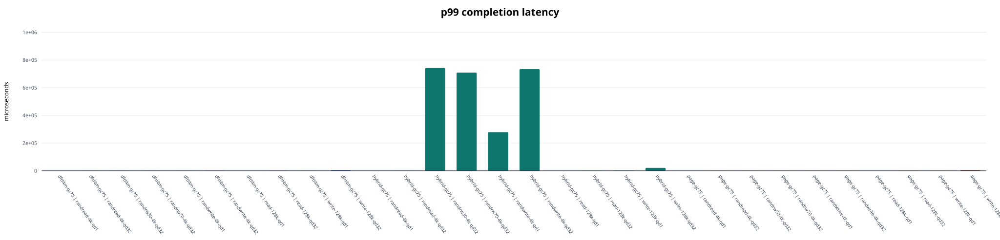
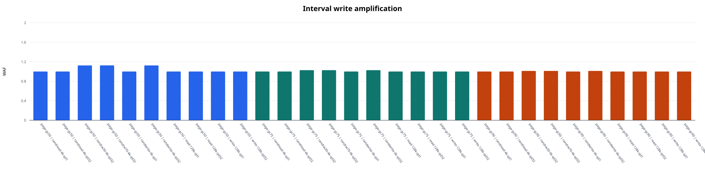

# FEMU SSD I/O Path Lab

FEMU NVMe black-box SSD에서 workload, FTL mapping, GC trigger가 IOPS, tail
latency, write amplification(WAF)에 미치는 영향을 같은 환경에서 측정한 재현
가능한 실험입니다. x86_64 Linux/KVM에서 실제 FEMU를 빌드하고 5개 full
condition, 150개 fio 반복 측정과 전후 SMART 원본을 완료했습니다.

고정 FEMU revision은
`39664d2424eaa4ebdcf8400f8973d3ad445644a6`입니다.

## 완료 상태

- [x] x86_64/KVM host와 `/dev/kvm` 접근 검증
- [x] 고정 revision FEMU 빌드 및 binary/device/hash 검증
- [x] Ubuntu guest 준비, FEMU namespace 식별, smoke test
- [x] Phase A: page mapping의 10개 workload 특성 측정
- [x] Phase B: page/DFTL 4 MiB/hybrid mapping 비교
- [x] Phase C: page mapping의 GC threshold 50/75/90 비교
- [x] 각 condition의 fresh overlay, 3회 반복, raw fio/SMART 보존
- [x] 통합 CSV/Markdown/SVG, 변동성 표, source-level 원인 조사
- [x] host/guest/build/run provenance와 전체 SHA-256 manifest 보존

## 실행 환경과 방법

| 항목 | 값 |
|---|---|
| Host | Ubuntu 24.04.4, Linux 7.0.0-30, x86_64, KVM |
| CPU / RAM | Intel Core i7-1165G7, 8 logical CPU, 15.3 GiB |
| FEMU | pinned revision, QEMU 10.1.0, 4 GiB BBSSD |
| Guest | Ubuntu 24.04.4, Linux 6.8.0-137 |
| Tools | fio 3.36, nvme-cli 2.8, Python 3.12.3 |
| Full run | 80% target, precondition 2회, ramp 10초, runtime 60초, 반복 3회 |
| 공통 정책 | greedy GC, high threshold 95, 동일 NAND timing/geometry |

각 condition은 같은 prepared guest base에서 새 overlay를 만들고 FEMU process를
새로 시작했습니다. namespace는 model 문자열, 크기, mount 상태를 검사한 뒤에만
파괴적 fio를 허용했습니다. SMART의 누적값을 그대로 비교하지 않고 각 workload
전후 `host_write_pages`와 `gc_write_pages` delta로 interval WAF를 계산했습니다.

## 핵심 결과

모든 표는 3회 반복 중앙값입니다. mixed workload의 tail은 활성 read/write 방향 중
더 나쁜 값을 사용합니다.

### Phase A — queue depth와 workload

| Workload | QD | IOPS | p99 (us) | p99.9 (us) | WAF |
|---|---:|---:|---:|---:|---:|
| randread 4 KiB | 1 | 26,722 | 49.4 | 58.6 | 1.000 |
| randread 4 KiB | 32 | 308,053 | 166.9 | 212.0 | 1.000 |
| randwrite 4 KiB | 1 | 4,775 | 226.3 | 354.3 | 1.000 |
| randwrite 4 KiB | 32 | 145,746 | 252.9 | 3,784.7 | 1.027 |
| sequential read 128 KiB | 1 | 10,155 | 164.9 | 205.8 | 1.000 |
| sequential read 128 KiB | 32 | 65,952 | 839.7 | 1,011.7 | 1.000 |
| sequential write 128 KiB | 1 | 4,597 | 224.3 | 2,146.3 | 1.000 |
| sequential write 128 KiB | 32 | 9,623 | 5,210.1 | 5,275.6 | 1.000 |

QD32는 randread IOPS를 11.53배, randwrite를 30.53배 높였지만 tail도
증가했습니다. 특히 128 KiB sequential write의 p99는 23.23배가 됐습니다.
따라서 H2의 throughput/queueing trade-off는 관찰됐습니다. 다만 sequential은
128 KiB, random은 4 KiB이므로 access pattern만 분리하지 못합니다. 현재 matrix로
H1의 sequential/random 인과를 확정하지 않습니다.


### Phase B — FTL mapping

| Mapping | randwrite 4K QD32 IOPS | p99 (us) | WAF | randrw70 IOPS | p99 (us) |
|---|---:|---:|---:|---:|---:|
| page | 145,746 | 252.9 | 1.027 | 248,805 | 272.4 |
| DFTL 4 MiB | 98,382 | 880.6 | 1.027 | 154,825 | 700.4 |
| hybrid | 113.5 | 734,003.2 | 255.642 | 390.8 | 708,837.4 |

DFTL의 열 workload 전체 normalized geometric mean은 page 대비 IOPS 0.852배,
p99 1.623배였습니다. source에서 CMT miss가 translation-page NAND read를, dirty
eviction이 write와 직렬화된 read를 과금하는 경로를 확인했습니다.

Hybrid의 random write는 page보다 QD1에서 약 1,170배, QD32에서 약 1,284배
느렸고 interval WAF는 244–259였습니다. 이는 단순한 작은 성능 차가 아닙니다.
기본 log block이 16개뿐이고 random overwrite가 sequential switch-merge 조건을
깨뜨려, pool 고갈 때 valid page를 읽고 다시 쓰는 full merge가 반복되는 구현과
일치합니다.



### Phase C — GC trigger

| Threshold | randwrite 4K QD32 IOPS | p99 (us) | p99.9 (us) | interval WAF |
|---:|---:|---:|---:|---:|
| 50 | 135,339 | 280.6 | 8,978.4 | 1.125 |
| 75 | 145,746 | 252.9 | 3,784.7 | 1.027 |
| 90 | 143,889 | 272.4 | 2,900.0 | 1.012 |

이 구현은 `gc_thres_lines = (1 - threshold/100) * total_lines`로 변환하고 free
line 수가 그 이하일 때 GC를 시작합니다. 따라서 50은 더 많은 free line이 남을
때 일찍 동작했고, 이 측정창에서 relocation과 WAF가 가장 컸습니다. Threshold 75가
전체 normalized geometric mean에서 가장 좋았지만, read-only workload에도
condition 간 drift가 있어 고정 workload 순서와 host scheduling의 영향을 배제할
수 없습니다. 75를 보편적 최적값으로 주장하지 않습니다.



## 반복 변동과 해석 한계

대부분의 IOPS 반복 상대 범위는 작았고 최댓값은 hybrid randwrite QD1의
7.61%였습니다. p99 최댓값은 page-gc90 sequential write QD1의 11.26%였습니다.
반면 p99.9는 hybrid mixed workload에서 크게 흔들렸습니다. randrw30의 범위는
1.619–10.536초(중앙값 2.265초, 상대 범위 393.7%)였습니다. 이 긴 tail은 실제
관찰값이지만 3회 반복만으로 안정적인 극단 percentile을 일반화할 수 없습니다.

FEMU는 실제 SSD firmware가 아니며, 한 condition 안의 workload는 고정 순서로
실행됐습니다. host governor는 `powersave`였고 CPU pinning/perf profiling은 하지
않았습니다. 결과는 이 revision과 모델 안의 비교입니다.

## 재현과 증거 탐색

```bash
make test
make dry-run
python3 -m ssdbench.analyze \
  --input results \
  --output results/report \
  --profile full
(cd results && sha256sum -c SHA256SUMS.txt)
```

- 한국어 상세 분석: [docs/ANALYSIS_REPORT_KO.md](docs/ANALYSIS_REPORT_KO.md)
- 실험 설계와 위협: [docs/EXPERIMENT_PLAN.md](docs/EXPERIMENT_PLAN.md)
- source-level I/O path: [docs/IO_PATH.md](docs/IO_PATH.md)
- Linux/KVM 재현 절차: [docs/SETUP_LINUX.md](docs/SETUP_LINUX.md)
- raw/derived 결과 인덱스: [results/README.md](results/README.md)
- 실제 환경·condition manifest: [results/EXPERIMENT_MANIFEST.md](results/EXPERIMENT_MANIFEST.md)
- 통합 150-run CSV: [results/report/runs.csv](results/report/runs.csv)
- 전체 중앙값 표: [results/report/REPORT.md](results/report/REPORT.md)
- 반복 변동성: [results/report/variability.csv](results/report/variability.csv)

`results/host-parser-macos-arm64-2026-08-21.json`의 parser microbenchmark는 이전
host-side 분석기 검증이며 SSD 성능 수치가 아닙니다.

FEMU와 fio는 각 upstream 라이선스를 따릅니다. 이 저장소가 작성한 harness와
문서는 MIT License로 배포합니다.
