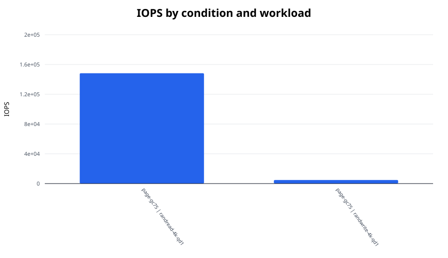
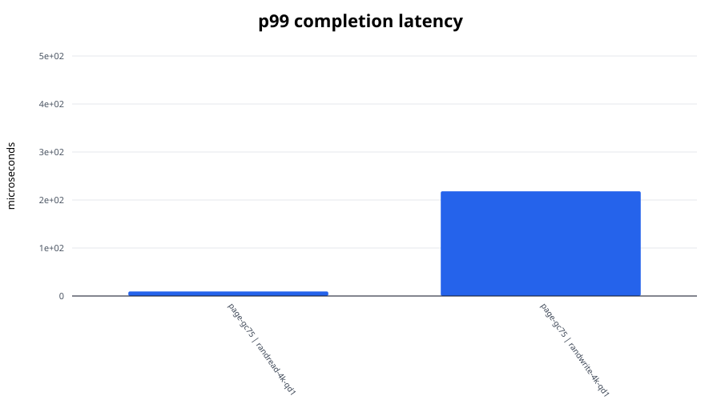
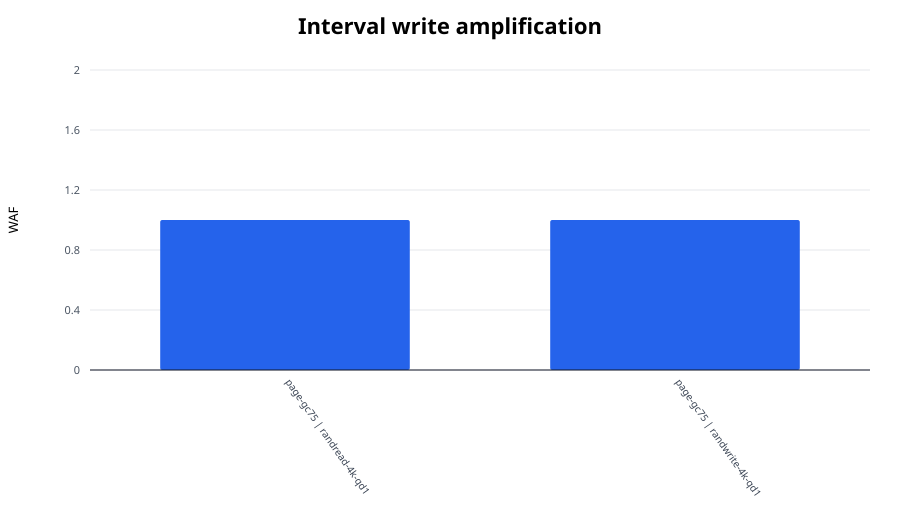

# FEMU SSD I/O experiment report

Median values across repetitions. Mixed workloads use the worse active-direction tail latency.

| Condition | Workload | IOPS | BW (MiB/s) | p99 (us) | p99.9 (us) | WAF |
|---|---|---:|---:|---:|---:|---:|
| page-gc75 | randread-4k-qd1 | 148,281.9 | 579.2 | 9.5 | 15.3 | 1.000 |
| page-gc75 | randwrite-4k-qd1 | 4,801.4 | 18.8 | 218.1 | 264.2 | 1.000 |

## Figures

