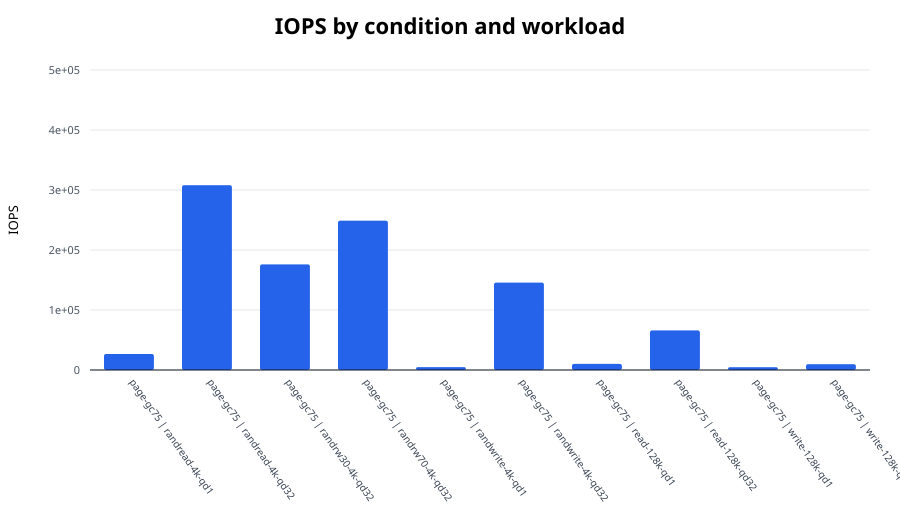
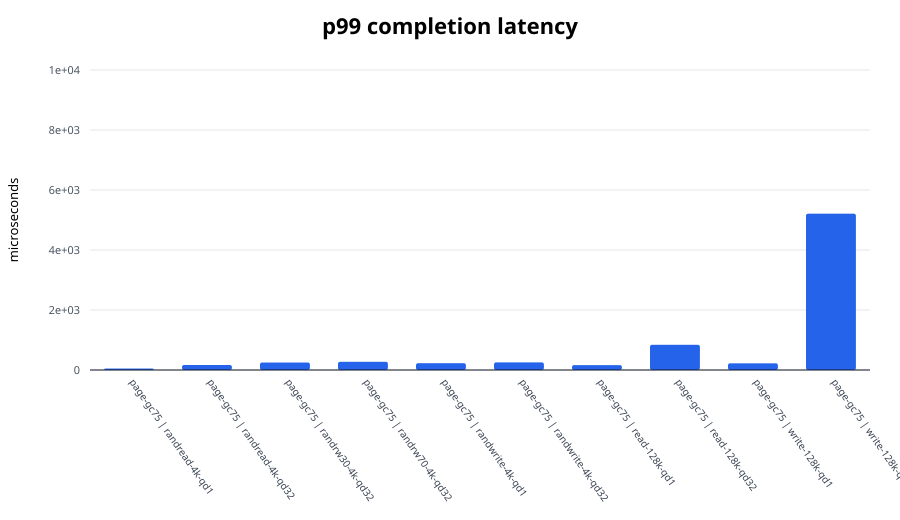
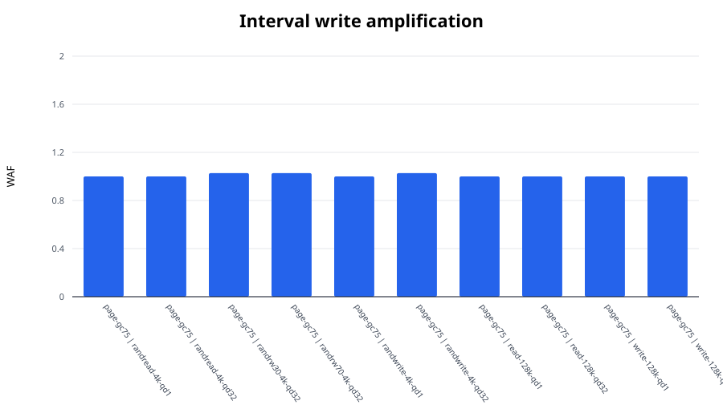

# FEMU SSD I/O experiment report

Median values across repetitions. Mixed workloads use the worse active-direction tail latency.

| Condition | Workload | IOPS | BW (MiB/s) | p99 (us) | p99.9 (us) | WAF |
|---|---|---:|---:|---:|---:|---:|
| page-gc75 | randread-4k-qd1 | 26,722.4 | 104.4 | 49.4 | 58.6 | 1.000 |
| page-gc75 | randread-4k-qd32 | 308,053.4 | 1,203.3 | 166.9 | 212.0 | 1.000 |
| page-gc75 | randrw30-4k-qd32 | 176,035.2 | 687.6 | 250.9 | 3,686.4 | 1.027 |
| page-gc75 | randrw70-4k-qd32 | 248,804.9 | 971.9 | 272.4 | 391.2 | 1.027 |
| page-gc75 | randwrite-4k-qd1 | 4,774.5 | 18.7 | 226.3 | 354.3 | 1.000 |
| page-gc75 | randwrite-4k-qd32 | 145,746.3 | 569.3 | 252.9 | 3,784.7 | 1.027 |
| page-gc75 | read-128k-qd1 | 10,154.9 | 1,269.4 | 164.9 | 205.8 | 1.000 |
| page-gc75 | read-128k-qd32 | 65,952.2 | 8,244.1 | 839.7 | 1,011.7 | 1.000 |
| page-gc75 | write-128k-qd1 | 4,596.7 | 574.6 | 224.3 | 2,146.3 | 1.000 |
| page-gc75 | write-128k-qd32 | 9,622.7 | 1,202.9 | 5,210.1 | 5,275.6 | 1.000 |

## Figures

