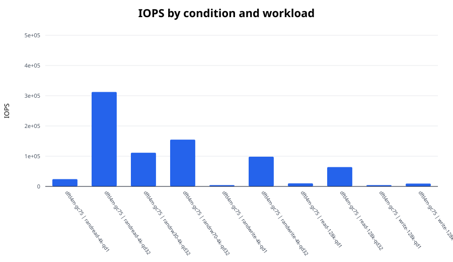
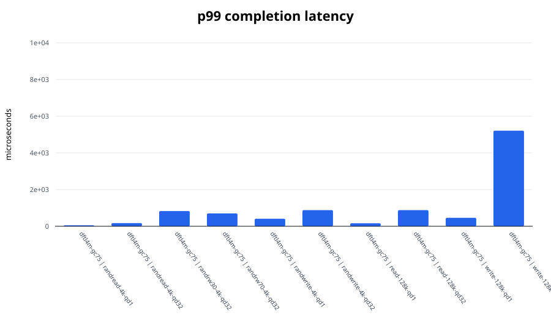
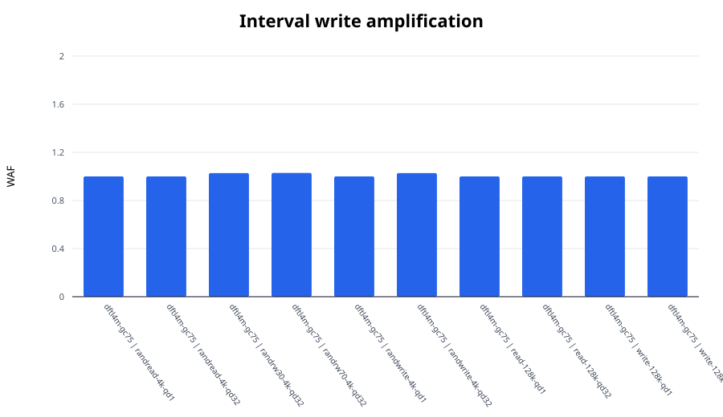

# FEMU SSD I/O experiment report

Median values across repetitions. Mixed workloads use the worse active-direction tail latency.

| Condition | Workload | IOPS | BW (MiB/s) | p99 (us) | p99.9 (us) | WAF |
|---|---|---:|---:|---:|---:|---:|
| dftl4m-gc75 | randread-4k-qd1 | 24,142.8 | 94.3 | 52.0 | 86.5 | 1.000 |
| dftl4m-gc75 | randread-4k-qd32 | 312,512.1 | 1,220.8 | 173.1 | 216.1 | 1.000 |
| dftl4m-gc75 | randrw30-4k-qd32 | 111,558.2 | 435.8 | 831.5 | 3,719.2 | 1.027 |
| dftl4m-gc75 | randrw70-4k-qd32 | 154,825.3 | 604.8 | 700.4 | 1,056.8 | 1.028 |
| dftl4m-gc75 | randwrite-4k-qd1 | 4,322.7 | 16.9 | 411.6 | 477.2 | 1.000 |
| dftl4m-gc75 | randwrite-4k-qd32 | 98,381.9 | 384.3 | 880.6 | 3,850.2 | 1.027 |
| dftl4m-gc75 | read-128k-qd1 | 10,121.5 | 1,265.2 | 164.9 | 212.0 | 1.000 |
| dftl4m-gc75 | read-128k-qd32 | 64,051.2 | 8,006.5 | 880.6 | 1,073.2 | 1.000 |
| dftl4m-gc75 | write-128k-qd1 | 4,350.9 | 543.9 | 460.8 | 2,146.3 | 1.000 |
| dftl4m-gc75 | write-128k-qd32 | 9,580.5 | 1,197.6 | 5,210.1 | 5,406.7 | 1.000 |

## Figures

