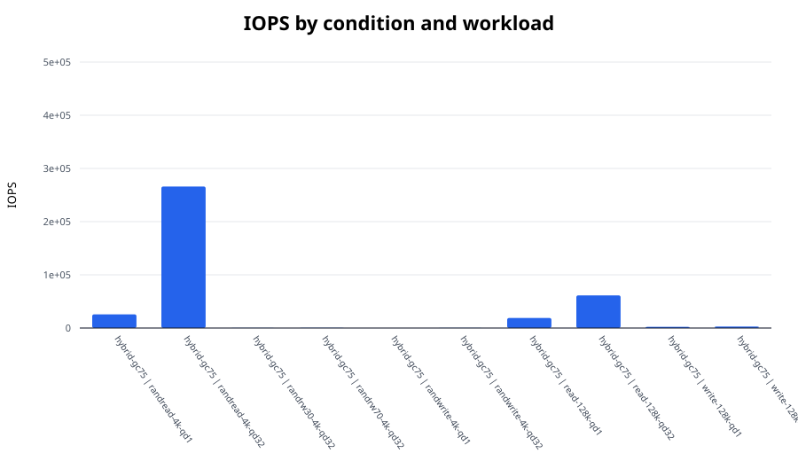
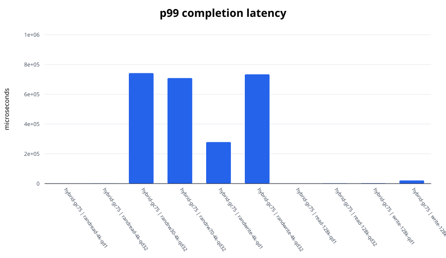
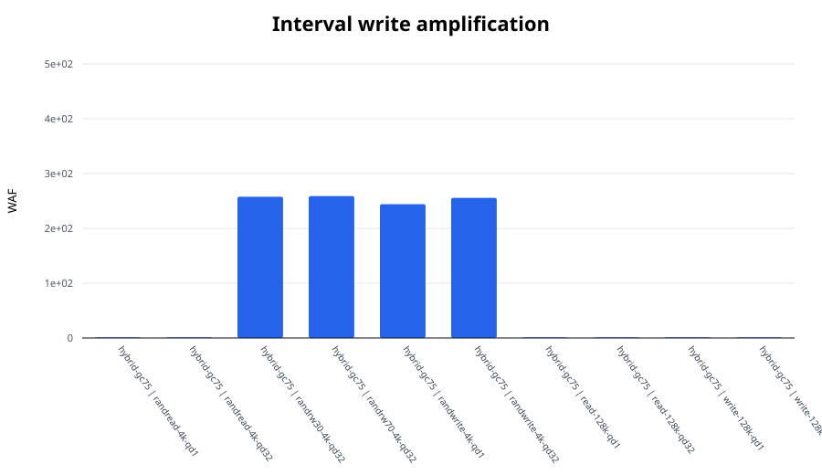

# FEMU SSD I/O experiment report

Median values across repetitions. Mixed workloads use the worse active-direction tail latency.

| Condition | Workload | IOPS | BW (MiB/s) | p99 (us) | p99.9 (us) | WAF |
|---|---|---:|---:|---:|---:|---:|
| hybrid-gc75 | randread-4k-qd1 | 25,626.8 | 100.1 | 53.0 | 181.2 | 1.000 |
| hybrid-gc75 | randread-4k-qd32 | 265,944.0 | 1,038.8 | 216.1 | 284.7 | 1.000 |
| hybrid-gc75 | randrw30-4k-qd32 | 161.9 | 0.6 | 742,391.8 | 2,264,924.2 | 257.688 |
| hybrid-gc75 | randrw70-4k-qd32 | 390.8 | 1.5 | 708,837.4 | 1,132,462.1 | 258.773 |
| hybrid-gc75 | randwrite-4k-qd1 | 4.1 | 0.0 | 278,921.2 | 283,115.5 | 244.157 |
| hybrid-gc75 | randwrite-4k-qd32 | 113.5 | 0.4 | 734,003.2 | 11,878,268.9 | 255.642 |
| hybrid-gc75 | read-128k-qd1 | 18,901.1 | 2,362.6 | 56.6 | 146.4 | 1.000 |
| hybrid-gc75 | read-128k-qd32 | 61,333.2 | 7,666.7 | 970.8 | 1,187.8 | 1.000 |
| hybrid-gc75 | write-128k-qd1 | 2,094.0 | 261.8 | 2,113.5 | 2,211.8 | 1.001 |
| hybrid-gc75 | write-128k-qd32 | 2,809.2 | 351.2 | 21,102.6 | 21,102.6 | 1.001 |

## Figures

