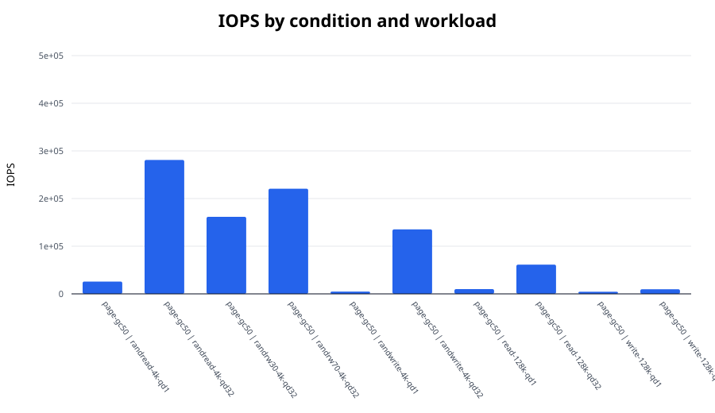
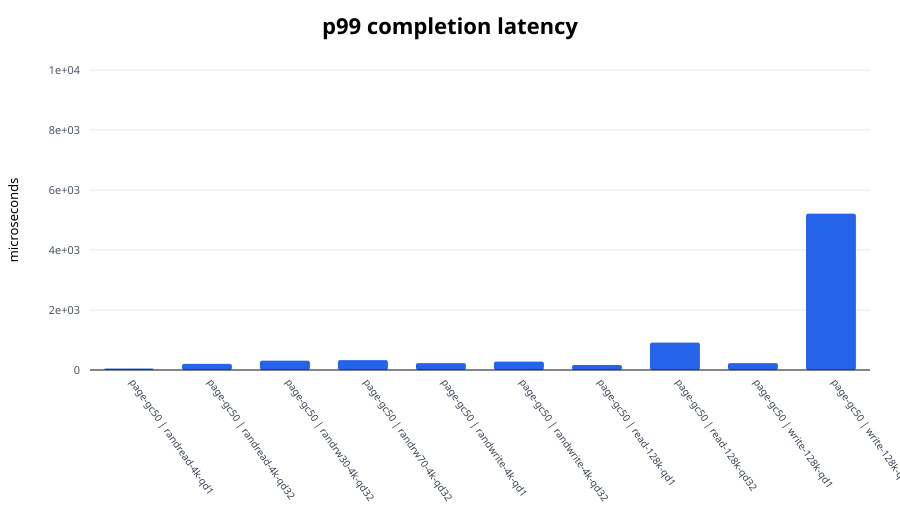
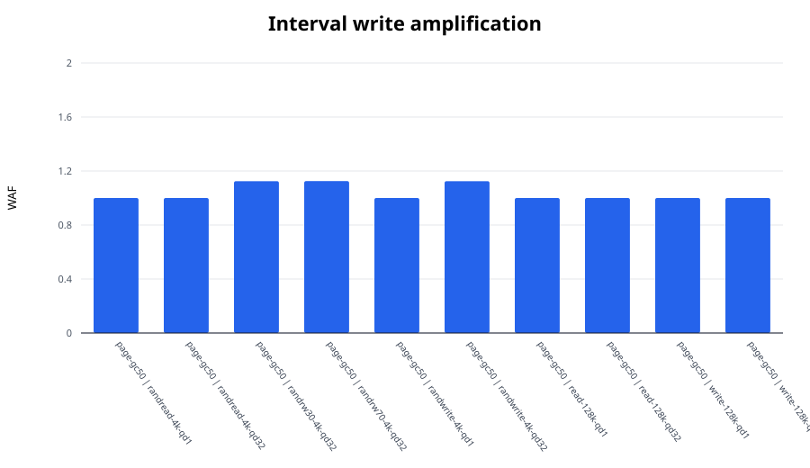

# FEMU SSD I/O experiment report

Median values across repetitions. Mixed workloads use the worse active-direction tail latency.

| Condition | Workload | IOPS | BW (MiB/s) | p99 (us) | p99.9 (us) | WAF |
|---|---|---:|---:|---:|---:|---:|
| page-gc50 | randread-4k-qd1 | 25,915.8 | 101.2 | 51.5 | 89.6 | 1.000 |
| page-gc50 | randread-4k-qd32 | 281,068.2 | 1,097.9 | 201.7 | 259.1 | 1.000 |
| page-gc50 | randrw30-4k-qd32 | 161,655.5 | 631.5 | 309.2 | 8,847.4 | 1.125 |
| page-gc50 | randrw70-4k-qd32 | 220,735.6 | 862.3 | 329.7 | 489.5 | 1.125 |
| page-gc50 | randwrite-4k-qd1 | 4,752.1 | 18.6 | 228.4 | 297.0 | 1.000 |
| page-gc50 | randwrite-4k-qd32 | 135,338.5 | 528.7 | 280.6 | 8,978.4 | 1.125 |
| page-gc50 | read-128k-qd1 | 10,001.2 | 1,250.2 | 166.9 | 205.8 | 1.000 |
| page-gc50 | read-128k-qd32 | 61,294.4 | 7,661.9 | 913.4 | 1,122.3 | 1.000 |
| page-gc50 | write-128k-qd1 | 4,568.6 | 571.1 | 228.4 | 2,146.3 | 1.000 |
| page-gc50 | write-128k-qd32 | 9,624.5 | 1,203.1 | 5,210.1 | 5,275.6 | 1.000 |

## Figures

