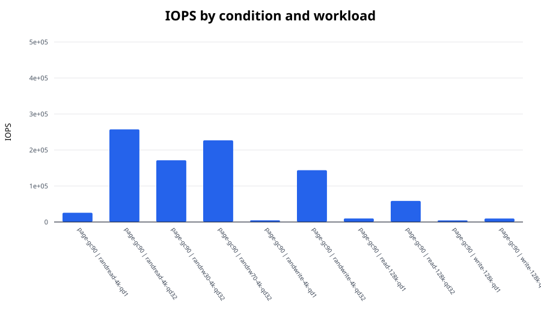
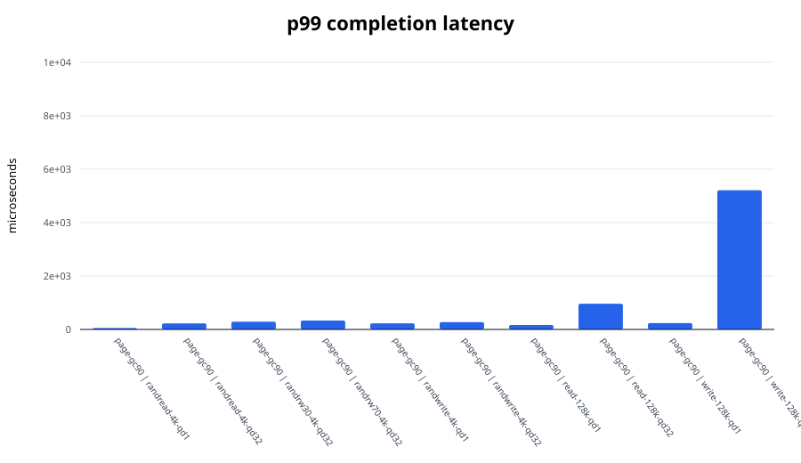
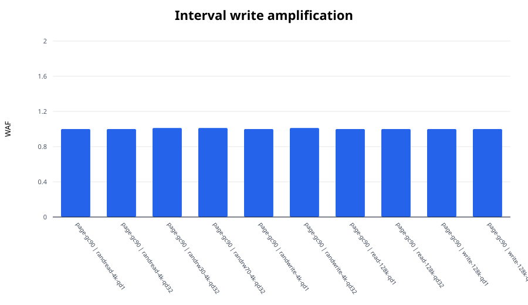

# FEMU SSD I/O experiment report

Median values across repetitions. Mixed workloads use the worse active-direction tail latency.

| Condition | Workload | IOPS | BW (MiB/s) | p99 (us) | p99.9 (us) | WAF |
|---|---|---:|---:|---:|---:|---:|
| page-gc90 | randread-4k-qd1 | 25,680.7 | 100.3 | 52.5 | 66.0 | 1.000 |
| page-gc90 | randread-4k-qd32 | 257,276.3 | 1,005.0 | 226.3 | 284.7 | 1.000 |
| page-gc90 | randrw30-4k-qd32 | 171,520.6 | 670.0 | 288.8 | 2,801.7 | 1.012 |
| page-gc90 | randrw70-4k-qd32 | 226,765.1 | 885.8 | 333.8 | 485.4 | 1.012 |
| page-gc90 | randwrite-4k-qd1 | 4,736.5 | 18.5 | 230.4 | 313.3 | 1.000 |
| page-gc90 | randwrite-4k-qd32 | 143,889.4 | 562.1 | 272.4 | 2,900.0 | 1.012 |
| page-gc90 | read-128k-qd1 | 9,868.1 | 1,233.5 | 166.9 | 207.9 | 1.000 |
| page-gc90 | read-128k-qd32 | 58,547.6 | 7,318.5 | 962.6 | 1,286.1 | 1.000 |
| page-gc90 | write-128k-qd1 | 4,533.0 | 566.6 | 236.5 | 2,179.1 | 1.000 |
| page-gc90 | write-128k-qd32 | 9,623.9 | 1,203.0 | 5,210.1 | 5,275.6 | 1.000 |

## Figures

