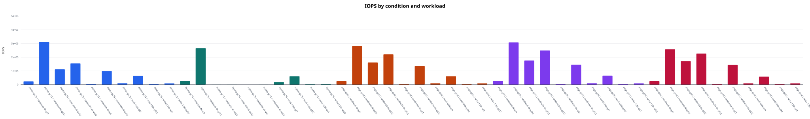
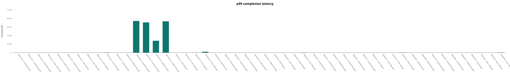
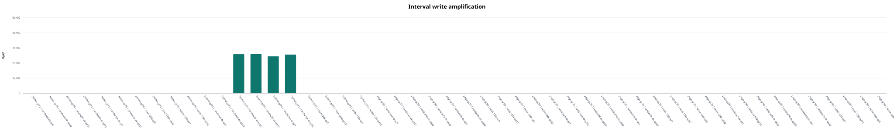

# FEMU SSD I/O experiment report

Median values across repetitions. Mixed workloads use the worse active-direction tail latency.

| Condition | Workload | IOPS | BW (MiB/s) | p99 (us) | p99.9 (us) | WAF |
|---|---|---:|---:|---:|---:|---:|
| dftl4m-gc75 | randread-4k-qd1 | 24,142.8 | 94.3 | 52.0 | 86.5 | 1.000 |
| dftl4m-gc75 | randread-4k-qd32 | 312,512.1 | 1,220.8 | 173.1 | 216.1 | 1.000 |
| dftl4m-gc75 | randrw30-4k-qd32 | 111,558.2 | 435.8 | 831.5 | 3,719.2 | 1.027 |
| dftl4m-gc75 | randrw70-4k-qd32 | 154,825.3 | 604.8 | 700.4 | 1,056.8 | 1.028 |
| dftl4m-gc75 | randwrite-4k-qd1 | 4,322.7 | 16.9 | 411.6 | 477.2 | 1.000 |
| dftl4m-gc75 | randwrite-4k-qd32 | 98,381.9 | 384.3 | 880.6 | 3,850.2 | 1.027 |
| dftl4m-gc75 | read-128k-qd1 | 10,121.5 | 1,265.2 | 164.9 | 212.0 | 1.000 |
| dftl4m-gc75 | read-128k-qd32 | 64,051.2 | 8,006.5 | 880.6 | 1,073.2 | 1.000 |
| dftl4m-gc75 | write-128k-qd1 | 4,350.9 | 543.9 | 460.8 | 2,146.3 | 1.000 |
| dftl4m-gc75 | write-128k-qd32 | 9,580.5 | 1,197.6 | 5,210.1 | 5,406.7 | 1.000 |
| hybrid-gc75 | randread-4k-qd1 | 25,626.8 | 100.1 | 53.0 | 181.2 | 1.000 |
| hybrid-gc75 | randread-4k-qd32 | 265,944.0 | 1,038.8 | 216.1 | 284.7 | 1.000 |
| hybrid-gc75 | randrw30-4k-qd32 | 161.9 | 0.6 | 742,391.8 | 2,264,924.2 | 257.688 |
| hybrid-gc75 | randrw70-4k-qd32 | 390.8 | 1.5 | 708,837.4 | 1,132,462.1 | 258.773 |
| hybrid-gc75 | randwrite-4k-qd1 | 4.1 | 0.0 | 278,921.2 | 283,115.5 | 244.157 |
| hybrid-gc75 | randwrite-4k-qd32 | 113.5 | 0.4 | 734,003.2 | 11,878,268.9 | 255.642 |
| hybrid-gc75 | read-128k-qd1 | 18,901.1 | 2,362.6 | 56.6 | 146.4 | 1.000 |
| hybrid-gc75 | read-128k-qd32 | 61,333.2 | 7,666.7 | 970.8 | 1,187.8 | 1.000 |
| hybrid-gc75 | write-128k-qd1 | 2,094.0 | 261.8 | 2,113.5 | 2,211.8 | 1.001 |
| hybrid-gc75 | write-128k-qd32 | 2,809.2 | 351.2 | 21,102.6 | 21,102.6 | 1.001 |
| page-gc50 | randread-4k-qd1 | 25,915.8 | 101.2 | 51.5 | 89.6 | 1.000 |
| page-gc50 | randread-4k-qd32 | 281,068.2 | 1,097.9 | 201.7 | 259.1 | 1.000 |
| page-gc50 | randrw30-4k-qd32 | 161,655.5 | 631.5 | 309.2 | 8,847.4 | 1.125 |
| page-gc50 | randrw70-4k-qd32 | 220,735.6 | 862.3 | 329.7 | 489.5 | 1.125 |
| page-gc50 | randwrite-4k-qd1 | 4,752.1 | 18.6 | 228.4 | 297.0 | 1.000 |
| page-gc50 | randwrite-4k-qd32 | 135,338.5 | 528.7 | 280.6 | 8,978.4 | 1.125 |
| page-gc50 | read-128k-qd1 | 10,001.2 | 1,250.2 | 166.9 | 205.8 | 1.000 |
| page-gc50 | read-128k-qd32 | 61,294.4 | 7,661.9 | 913.4 | 1,122.3 | 1.000 |
| page-gc50 | write-128k-qd1 | 4,568.6 | 571.1 | 228.4 | 2,146.3 | 1.000 |
| page-gc50 | write-128k-qd32 | 9,624.5 | 1,203.1 | 5,210.1 | 5,275.6 | 1.000 |
| page-gc75 | randread-4k-qd1 | 26,722.4 | 104.4 | 49.4 | 58.6 | 1.000 |
| page-gc75 | randread-4k-qd32 | 308,053.4 | 1,203.3 | 166.9 | 212.0 | 1.000 |
| page-gc75 | randrw30-4k-qd32 | 176,035.2 | 687.6 | 250.9 | 3,686.4 | 1.027 |
| page-gc75 | randrw70-4k-qd32 | 248,804.9 | 971.9 | 272.4 | 391.2 | 1.027 |
| page-gc75 | randwrite-4k-qd1 | 4,774.5 | 18.7 | 226.3 | 354.3 | 1.000 |
| page-gc75 | randwrite-4k-qd32 | 145,746.3 | 569.3 | 252.9 | 3,784.7 | 1.027 |
| page-gc75 | read-128k-qd1 | 10,154.9 | 1,269.4 | 164.9 | 205.8 | 1.000 |
| page-gc75 | read-128k-qd32 | 65,952.2 | 8,244.1 | 839.7 | 1,011.7 | 1.000 |
| page-gc75 | write-128k-qd1 | 4,596.7 | 574.6 | 224.3 | 2,146.3 | 1.000 |
| page-gc75 | write-128k-qd32 | 9,622.7 | 1,202.9 | 5,210.1 | 5,275.6 | 1.000 |
| page-gc90 | randread-4k-qd1 | 25,680.7 | 100.3 | 52.5 | 66.0 | 1.000 |
| page-gc90 | randread-4k-qd32 | 257,276.3 | 1,005.0 | 226.3 | 284.7 | 1.000 |
| page-gc90 | randrw30-4k-qd32 | 171,520.6 | 670.0 | 288.8 | 2,801.7 | 1.012 |
| page-gc90 | randrw70-4k-qd32 | 226,765.1 | 885.8 | 333.8 | 485.4 | 1.012 |
| page-gc90 | randwrite-4k-qd1 | 4,736.5 | 18.5 | 230.4 | 313.3 | 1.000 |
| page-gc90 | randwrite-4k-qd32 | 143,889.4 | 562.1 | 272.4 | 2,900.0 | 1.012 |
| page-gc90 | read-128k-qd1 | 9,868.1 | 1,233.5 | 166.9 | 207.9 | 1.000 |
| page-gc90 | read-128k-qd32 | 58,547.6 | 7,318.5 | 962.6 | 1,286.1 | 1.000 |
| page-gc90 | write-128k-qd1 | 4,533.0 | 566.6 | 236.5 | 2,179.1 | 1.000 |
| page-gc90 | write-128k-qd32 | 9,623.9 | 1,203.0 | 5,210.1 | 5,275.6 | 1.000 |

## Figures

